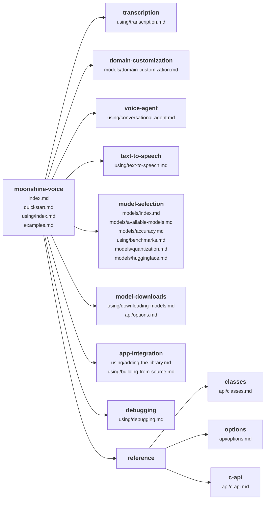

# Skill tree plan

```mermaid
graph LR
  n0["<b>moonshine-voice</b><br/><small>index.md<br/>quickstart.md<br/>using/index.md<br/>examples.md</small>"]
  n1["<b>transcription</b><br/><small>using/transcription.md</small>"]
  n0 --> n1
  n2["<b>domain-customization</b><br/><small>models/domain-customization.md</small>"]
  n0 --> n2
  n3["<b>voice-agent</b><br/><small>using/conversational-agent.md</small>"]
  n0 --> n3
  n4["<b>text-to-speech</b><br/><small>using/text-to-speech.md</small>"]
  n0 --> n4
  n5["<b>model-selection</b><br/><small>models/index.md<br/>models/available-models.md<br/>models/accuracy.md<br/>using/benchmarks.md<br/>models/quantization.md<br/>models/huggingface.md</small>"]
  n0 --> n5
  n6["<b>model-downloads</b><br/><small>using/downloading-models.md<br/>api/options.md</small>"]
  n0 --> n6
  n7["<b>app-integration</b><br/><small>using/adding-the-library.md<br/>using/building-from-source.md</small>"]
  n0 --> n7
  n8["<b>debugging</b><br/><small>using/debugging.md</small>"]
  n0 --> n8
  n9["<b>reference</b><br/><small></small>"]
  n0 --> n9
  n10["<b>classes</b><br/><small>api/classes.md</small>"]
  n9 --> n10
  n11["<b>options</b><br/><small>api/options.md</small>"]
  n9 --> n11
  n12["<b>c-api</b><br/><small>api/c-api.md</small>"]
  n9 --> n12
```
