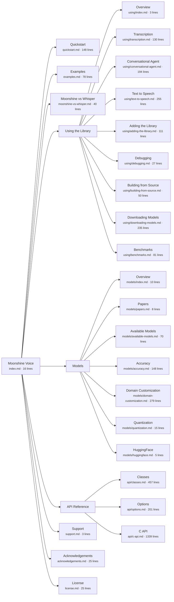

# Docs taxonomy

Source: mkdocs nav (mkdocs.yml)

```mermaid
graph LR
  n0["Moonshine Voice<br/><small>index.md · 16 lines</small>"]
  n1["Quickstart<br/><small>quickstart.md · 148 lines</small>"]
  n0 --> n1
  n2["Examples<br/><small>examples.md · 78 lines</small>"]
  n0 --> n2
  n3["Moonshine vs Whisper<br/><small>moonshine-vs-whisper.md · 40 lines</small>"]
  n0 --> n3
  n4["Using the Library"]
  n0 --> n4
  n5["Overview<br/><small>using/index.md · 3 lines</small>"]
  n4 --> n5
  n6["Transcription<br/><small>using/transcription.md · 130 lines</small>"]
  n4 --> n6
  n7["Conversational Agent<br/><small>using/conversational-agent.md · 194 lines</small>"]
  n4 --> n7
  n8["Text to Speech<br/><small>using/text-to-speech.md · 255 lines</small>"]
  n4 --> n8
  n9["Adding the Library<br/><small>using/adding-the-library.md · 111 lines</small>"]
  n4 --> n9
  n10["Debugging<br/><small>using/debugging.md · 27 lines</small>"]
  n4 --> n10
  n11["Building from Source<br/><small>using/building-from-source.md · 50 lines</small>"]
  n4 --> n11
  n12["Downloading Models<br/><small>using/downloading-models.md · 235 lines</small>"]
  n4 --> n12
  n13["Benchmarks<br/><small>using/benchmarks.md · 81 lines</small>"]
  n4 --> n13
  n14["Models"]
  n0 --> n14
  n15["Overview<br/><small>models/index.md · 10 lines</small>"]
  n14 --> n15
  n16["Papers<br/><small>models/papers.md · 8 lines</small>"]
  n14 --> n16
  n17["Available Models<br/><small>models/available-models.md · 70 lines</small>"]
  n14 --> n17
  n18["Accuracy<br/><small>models/accuracy.md · 148 lines</small>"]
  n14 --> n18
  n19["Domain Customization<br/><small>models/domain-customization.md · 279 lines</small>"]
  n14 --> n19
  n20["Quantization<br/><small>models/quantization.md · 15 lines</small>"]
  n14 --> n20
  n21["HuggingFace<br/><small>models/huggingface.md · 5 lines</small>"]
  n14 --> n21
  n22["API Reference"]
  n0 --> n22
  n23["Classes<br/><small>api/classes.md · 457 lines</small>"]
  n22 --> n23
  n24["Options<br/><small>api/options.md · 201 lines</small>"]
  n22 --> n24
  n25["C API<br/><small>api/c-api.md · 1339 lines</small>"]
  n22 --> n25
  n26["Support<br/><small>support.md · 3 lines</small>"]
  n0 --> n26
  n27["Acknowledgements<br/><small>acknowledgements.md · 25 lines</small>"]
  n0 --> n27
  n28["License<br/><small>license.md · 25 lines</small>"]
  n0 --> n28
```
